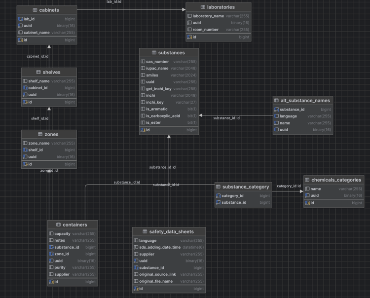

## LabManager - program do zarządzania laboratorium chemicznym.

Aplikacja ta ma na celu ułatwienie zarządzania odczynnikami w laboratorium chemicznym, tworzenie spisów wymaganych przez władze wydziału, instytutu, wewnętrzne przepisy laboratorium lub regulacje BHP.

Aplikacja zawiera encje opisujące substancje chemiczne (Substance), kartę charakterystyki substancji chemicznej (SafetyDataSheet), opakowanie zawierające odczynnik (Container), oraz encje opisujące lokalizacje poszczególnych opakowań - laboratorium (Laboratory), szafa (Cabinet), półka (Shelf) oraz strefa na półce (Zone). Lokalizacja poszczególnych opakowań jest jednoznacznie przez strefę, w której się znajdują.

# Substancje

Substancje, oprócz numeru CAS i angielskiej nazwy systematycznej, posiadają w bazie także swoją reprezentację SMILES oraz listę list alternatywnych. Dla każdej substancji można również wgrywać odpowiednie karty charakterystyki, podając link do karty, którą chcemy pobrać.

Część dostawców udostępnia karty charakterystyki za pośrednictwem stron wykorzystujących mechanizmy ochrony przed botami. Z tego względu proces pobierania kart charakterystyki został zrealizowany z wykorzystaniem biblioteki Selenium WebDriver.

Dane dotyczące substancji chemicznych wykorzystane w projekcie pochodzą z bazy CAS Substance Registry, dostępnej pod adresem: [CAS Registry Numbers Dataset](https://www.kaggle.com/datasets/epa/cas-registry-numbers)

# Struktura bazy danych

Struktura bazy danych wykorzystywanej przez aplikację została przedstawiona na poniższym diagramie:

